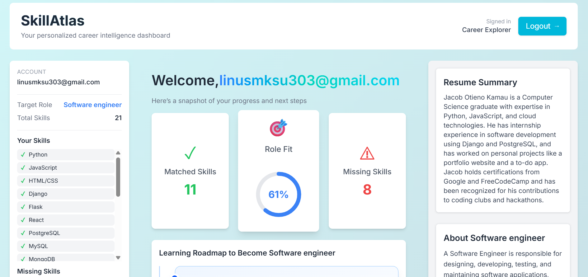

# SkillAtlas: Your Personal Career Navigator

> SkillAtlas is an AI-powered career development platform that helps individuals identify skill gaps and chart a personalized learning path to achieve their dream job. By analyzing your resume against a target role, SkillAtlas provides a comprehensive match score, highlights missing skills, and recommends curated learning resources and relevant job opportunities.

[**Live Demo (Coming Soon!)**](#) | [**Video Walkthrough**](#)
---
## Screenshots


_The main landing page of SkillAtlas._


_The user dashboard, showing the match score, skill gaps, and recommended learning path._
---

## The Problem: Navigating the Modern Career Landscape

Kimani had always been passionate about technology. Fresh out of university in Nairobi, he had a solid foundation in data analysis and software development. Yet, despite his skills, he felt stuck. Job postings for data engineers and AI specialists seemed out of reach, and every attempt to map his abilities to these roles left him overwhelmed.

He knew he was capable. Professors and mentors had praised his projects, and his internship at a local startup had shown him he could handle real-world challenges. But talent alone wasn’t enough.

Scrolling late at night, Kimani stumbled upon SkillAtlas. The platform analyzed his existing skills, compared them with his target roles, and highlighted gaps with actionable recommendations. He saw, for the first time, a clear path from “what I have” to “what I need”. SkillAtlas didn’t just tell him he was lacking; it showed him how to bridge the gap, step by step.

Relief washed over him. For the first time, he felt guided, supported, and hopeful. The anxiety of career uncertainty lifted as he realized he wasn’t lost—he just needed the right map. With a concrete plan in hand, Kimani enrolled in targeted courses, sharpened his portfolio, and soon landed his first role as a junior data engineer, confident that this was only the beginning.

## Key Features

*   **AI-Powered Resume Analysis:** Upload your CV and specify your target role. Our system, powered by advanced language models, performs a deep analysis of your skills and experience.
*   **Skill Gap Identification:** Receive a detailed "Match Score" that quantifies how well your profile aligns with your target role. SkillAtlas pinpoints the exact skills and qualifications you need to develop.
*   **Personalized Learning Paths:** Get a curated list of learning resources (articles, courses, tutorials) tailored to help you close your identified skill gaps.
*   **Targeted Job Opportunities:** Discover the latest job postings in your region that match your evolving skillset and career aspirations.
*   **Interactive Dashboard:** Visualize your career progression, track your learning, and explore new opportunities through a modern and intuitive user interface.

## How It Works

SkillAtlas is built on a cutting-edge, graph-based architecture using **Jac**, a novel programming language designed for building AI-native applications.

1.  **User Onboarding:** A new user signs up, providing their email, target job title, and a copy of their CV.
2.  **Graph Creation:** The system creates a `UserData` node in our graph database and parses the CV content.
3.  **Job & Skill Analysis:** Using AI agents (`walkers`), SkillAtlas fetches relevant job postings and builds a comprehensive graph of required skills for the target role.
4.  **Match & Gap Calculation:** An AI walker traverses the graph, comparing the user's skills (from their CV) with the required skills for the role, generating a match score and a list of skill gaps.
5.  **Resource Aggregation:** The system uses tools like FireCrawl and ScrapeDog to find relevant learning materials and job postings based on the identified skill gaps.
6.  **Data Presentation:** The frontend, also built in Jac, queries the backend and presents all this information—match score, skill gaps, learning resources, and job opportunities—on a personalized dashboard.

## Project Structure

The project is organized into a full-stack Jac application, with a clear separation between backend logic, frontend components, and core application files.

```
skillatlas/
├── app.jac              # Main application walker definitions (AI logic)
├── app.impl.jac         # Implementations for the app walkers
├── app.cl.jac           # Main frontend (client) entrypoint and routing
├── backend/
│   ├── models/
│   │   └── models.jac   # Data models (graph nodes)
│   └── edges/
│       └── edges.jac    # Graph edge definitions
├── frontend/
│   ├── pages/
│   │   ├── dashboard.jac
│   │   ├── homepage.jac
│   │   └── onboarding.jac
│   └── components/
│       ├── dashboard/
│       │   ├── dashboard_header.jac
│       │   └── ...
│       └── layout/
│           ├── Header.jac
│           └── Footer.jac
├── tools.jac            # Definitions for external tools (APIs)
├── utils.jac            # Utility functions and helpers
├── Dockerfile           # Container configuration
├── pyproject.toml       # Python dependencies (including Jac)
└── package.json         # Frontend dependencies (Vite, React)
```

## Tech Stack

*   **Core Language:** [**Jac**](https://www.jaseci.org/) - A full-stack, Python-based language utilizing Object-Spatial Programming (Nodes, Edges, Walkers) for building sophisticated, AI-driven graph applications.
*   **AI & Language Models:**
    *   **Mistral:** The core intelligence for resume parsing, skill extraction, and data analysis.
*   **Web Scraping & Data Aggregation:**
    *   **FireCrawl:** Used to fetch and crawl learning resources from across the web.
    *   **ScrapeDog:** Gathers the latest job postings from various job boards.
*   **Frontend:**
    *   Jac's client-side features with a JSX-like syntax.
    *   **Vite:** High-performance frontend tooling.
    *   **Tailwind CSS:** For modern, utility-first styling.
*   **Backend:**
    *   Jac's graph-based backend with a built-in ORM-like system.


## Getting Started

To run SkillAtlas locally, follow these steps:

1.  **Clone the repository:**
    ```bash
    git clone https://github.com/Developer-Linus/skillatlas.git
    cd skillatlas
    ```

2.  **Set up the environment:**
    *   Ensure you have Python 3.12+, uv, and Node.js installed.
    *   Create a virtual environment and install Python dependencies:
        ```bash
        uv venv .venv
        source .venv/bin/activate
        uv sync 
        ```
    *   Install frontend dependencies:
        ```bash
        npm install
        ```

3.  **Configure Environment Variables:**
    *   Copy the example environment file (.env.example):
        ```bash
        cp .env.example .env
        ```
    *   Add your API keys for Mistral, FireCrawl, ScrapeDog, etc., to the `.env` file.

4.  **Run the application:**
    *   Run the application:
        ```bash
        jac serve app.jac
        ```

5.  **Open your browser** and navigate to `http://localhost:8000/page/app`.

## Future Roadmap

*   [ ] **Real-time Notifications:** Alert users about new job matches and learning resources.
*   [ ] Integration with video platforms for course content.
*   [ ] Gamification of the learning process with points and badges.
*   [ ] Direct integration with job application platforms.
*   [ ] "Career Path" feature to visualize long-term career trajectories.
*   [ ] Enhanced AI-powered mock interviews based on target roles.

## Contributing

Contributions are what make the open-source community such an amazing place to learn, inspire, and create. Any contributions you make are **greatly appreciated**.

If you have a suggestion that would make this better, please fork the repo and create a pull request. You can also simply open an issue with the tag "enhancement".

1.  Fork the Project
2.  Create your Feature Branch (`git checkout -b feature/AmazingFeature`)
3.  Commit your Changes (`git commit -m 'Add some AmazingFeature'`)
4.  Push to the Branch (`git push origin feature/AmazingFeature`)
5.  Open a Pull Request

## License

Distributed under the MIT License. See `LICENSE` for more information.